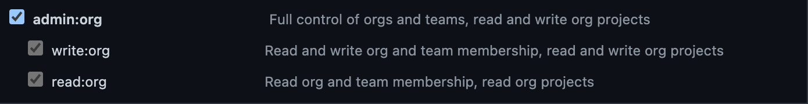
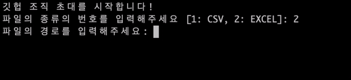

# Gitvite :incoming_envelope:

<div id="top"></div>

## 목차 :books:

- [소개 :tada:](#소개-tada)
- [기능 :rocket:](#기능-rocket)
- [라이선스 :scroll:](#라이선스-scroll)
- [수정일자 :calendar:](#수정일자-calendar)

### 소개 :tada:

#### 소개

**Gitvite**는 깃헙 조직에 사람을 간단하게 초대하기 위한 대화형 파이썬 애플리케이션입니다.

본 애플리케이션은 [글또]() 멤버들을 효과적으로 조직에 초대하기 위해 만들어졌습니다.

<p align="right">⬆️ <a href="#top">Back to Top</a></p>

#### 디렉토리 구조

본 애플리케이션의 디렉토리 구조는 아래와 같습니다.

이때 소스 코드가 들어있는 디렉토리는 [src](./src/) 폴더입니다.

```
.
├── LICENSE
├── README.md
├── examples
│   └── example.env
├── images
│   ├── 1.gif
│   └── 2.gif
├── .flake8
├── .pre-commit-config.yaml
├── poetry.lock
├── pyproject.toml
└── src
    ├── core
    ├── main.py
    ├── schema
    │   ├── __init__.py
    │   ├── information.py
    │   └── response.py
    ├── test
    │   └── __init__.py
    └── util
        ├── __init__.py
        ├── cli.py
        ├── github.py
        └── worker.py
```

<p align="right">⬆️ <a href="#top">Back to Top</a></p>

### 기능 :rocket:

#### 패키지 설치

패키지 관리는 [Poetry](https://python-poetry.org/)를 활용합니다.

만약 Poetry가 따로 설치되어 있지 않다면 아래와 같은 명령문으로 설치 가능합니다.

```Bash
pip install poetry
```

Poetry 설치와 관련된 더 자세한 내용은 공식 문서 중 [설치 부분](https://python-poetry.org/docs/#installation)을 통해 확인 가능합니다.

Poetry 설치가 되어 있거나 새로 설치를 완료하였다면 [pyproject.toml](./pyproject.toml) 파일이 존재하는 위치에서 아래와 같은 명령문을 입력합니다.

```Bash
poetry install
```

만약 개발 단계에 사용되는 패키지를 다운로드 받지 않길 원한다면 아래와 같은 명령문을 입력합니다.

```Bash
poetry install --no-dev
```

사용되는 패키지는 아래와 같습니다.

- `typer`
- `pandas`
- `pydantic`
- `requests`
- `email-validator`
- `python-dotenv`
- `openpyxl`

개발 단계에서 사용되는 패키지는 아래와 같습니다.

- `pre-commit`
- `flake8`
- `black`
- `isort`
- `mypy`
- `types-requests`

포매팅 관련한 값이 설정되어 있는 파일은 [.pre-commit-config.yaml](./.pre-commit-config.yaml) 파일과 [.flake8](./.flake8) 파일, 그리고 [pyproject.toml](./pyproject.toml) 파일입니다.

<p align="right">⬆️ <a href="#top">Back to Top</a></p>

#### 실행 방법

패키지 설치가 완료되었다면 아래와 같은 명령문으로 애플리케이션을 실행 가능합니다.

해당 명령문은 [src/main.py](./src/ma) 파일 내에 존재하는 `app()` 함수를 타겟으로 하여 실행합니다.

```Bash
poetry run python -m src.main
```

애플리케이션을 실행하면 아래 이미지와 같습니다.


<p align="right">⬆️ <a href="#top">Back to Top</a></p>

#### 깃헙 액세스 토큰 생성

본 애플리케이션을 이용하기 위해서는 깃헙 서비스에서 [Developer settings](https://github.com/settings/tokens/new) 페이지에 들어가 액세스 토큰을 발급 받아야 합니다.

이때 아래 이미지와 같이 `admin:org` 부분 중 `write:org` 및 `read:org` 권한을 허가해야 조직 초대가 가능해집니다.



<p align="right">⬆️ <a href="#top">Back to Top</a></p>

#### [.env](./examples/example.env) 파일 활용

`.env` 파일에 입력되어야 할 항목은 아래와 같습니다. 해당 부분은 [example.env](./examples/example.env) 파일에서도 확인 가능합니다.

이때 유의해야 할 사항은 `.env` 파일이 해당 애플리케이션 디렉토리의 최상단에 존재해야 한다는 것입니다.

```
# examples/example.env

FILE_TYPE=
FILE_PATH=

GITHUB_ACCOUNT_COLUMN_NAME=
GITHUB_ORGANIZATION_TEAMS_COLUMN_NAME=

GITHUB_ACCESS_TOKEN=
GITHUB_ORGANIZATION_NAME=
GITHUB_ORGANIZATION_TEAM_NAME=
```

이때 각각의 항목은 아래와 같은 의미를 같습니다

- `FILE_TYPE` : 대상이되는 파일의 종류입니다. 현재 `1` 은 `CSV` , `2` 는 `EXCEL` 파일을 의미합니다.
- `FILE_PATH` : 대상이 되는 파일의 경로입니다. 이때 절대경로 및 상대경로 모두 가능합니다.
- `GITHUB_ACCOUNT_COLUMN_NAME` : 파일 속 사용자들의 깃헙 계정이 저장되어 있는 컬럼명입니다.
- `GITHUB_ORGANIZATION_TEAMS_COLUMN_NAME` : 파일 속 사용자를 초대하려는 깃헙 조직 정보가 저장되어 있는 컬럼명입니다.
- `GITHUB_ACCESS_TOKEN` : 깃헙 서비스에서 발급 받은 액세스 토큰 값입니다.
- `GITHUB_ORGANIZATION_NAME` : 사용자를 초대하려는 깃헙 조직의 이름입니다.
- `GITHUB_ORGANIZATION_TEAM_NAME` : 사용자를 초대하려는 깃헙 조직의 팀 이름입니다.

만약 `.env` 파일이 존재하지 않거나 필수적으로 요구가 되는데 입력되지 않은 값이 존재하면 아래와 같이 터미널에서 대화형으로 값을 입력합니다.



<p align="right">⬆️ <a href="#top">Back to Top</a></p>

### 라이선스 :scroll:

본 애플리케이션 및 소스 코드는 [MIT 라이선스](./LICENSE) 정책을 따릅니다.

<p align="right">⬆️ <a href="#top">Back to Top</a></p>

### 수정일자 :calendar:

#### 2022. 07. 07. 목요일

- 최초 등록

<p align="right">⬆️ <a href="#top">Back to Top</a></p>
